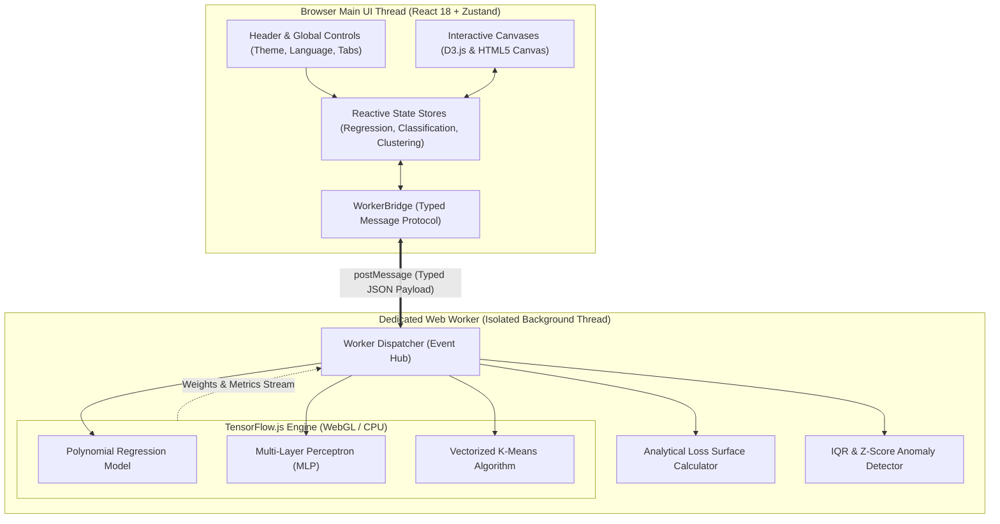

# ML Model Playground 🧪⚡

**Zero-Friction, 100% In-Browser Interactive Machine Learning Laboratory**  
*Explore gradient descent trajectories, non-linear decision boundaries, and Lloyd's clustering dynamics in real time.*

<p align="left">
  <a href="README.md"><b>English</b></a> • <a href="README.th.md"><b>ภาษาไทย</b></a> • <a href="https://zillerdx.github.io/ml-model-playground/"><b>Live Demo</b></a>
</p>

[](https://zillerdx.github.io/ml-model-playground/)
[](https://vitejs.dev/)
[](https://react.dev/)
[](https://www.typescriptlang.org/)
[](https://www.tensorflow.org/js)
[](https://tailwindcss.com/)
[-emerald?logo=vitest&logoColor=white)](https://vitest.dev/)
[](LICENSE)

[**Live Demo**](https://zillerdx.github.io/ml-model-playground/) • [**Visual Showcase**](#-visual-showcase) • [**Why In-Browser?**](#-why-in-browser) • [**Key Capabilities**](#-key-capabilities) • [**System Architecture**](#-system-architecture) • [**Technology Stack**](#-technology-stack) • [**Verification**](#-engineering-verification) • [**Quickstart**](#-local-quickstart) • [**Thai Documentation**](#-thai-documentation-คู่มือภาษาไทย)

---

## 🌟 Visual Showcase

<div align="center">
  <a href="https://zillerdx.github.io/ml-model-playground/">
    
  </a>
  <p><em>☀️ Default High-Contrast Light Mode — Polynomial Regression ($y = 0.742x - 0.217$) with real-time loss descent tracking.</em></p>
</div>

### 🔬 Core Laboratories & Analytical Tools

| 📈 Regression & 2D Loss Surface ($w \text{ vs } b$) | 🎯 Neural Network & Decision Boundary |
| :---: | :---: |
|  |  |
| **Loss Landscape**: 2D quadratic bowl $L(w,b)$ with live gradient descent ball trajectory rolling toward the analytical Ordinary Least Squares (OLS) global minimum $(w^*, b^*)$. | **Decision Boundary**: Multi-Layer Perceptron (MLP) with Tanh activations wrapping concentric non-linear rings with 100% classification accuracy. |

| 🧭 K-Means Clustering & Lloyd's Cycle | 📥 Custom CSV & Statistical Outlier Tools |
| :---: | :---: |
|  |  |
| **Lloyd's Cycle**: Step-by-step Voronoi partition assignment $\leftrightarrow$ centroid mean recalculation with real-time Within-Cluster Sum of Squares (WCSS) inertia monitoring. | **Data Tools**: Real-time statistical $1.5 \times \text{IQR}$ and $|z| > 2.6$ outlier detection, single-click surgical filtering, and coordinate auto-normalization. |

---

## 💡 Why In-Browser?

### 1. The Problem
Traditional machine learning environments (Jupyter Notebooks, Google Colab, and terminal scripts) create significant cognitive and environmental friction:
- **Environment Setup Hell**: Beginners spend hours debugging Python versions, virtual environments, Pip/Conda dependencies, and native CUDA/C++ builds before fitting their first curve.
- **Disconnected Execution Loops**: Cell-based execution introduces severe latency; learners adjust a parameter, wait for a cell to execute, and lose immediate visual cause-and-effect intuition.
- **Static Mathematical Abstractions**: Crucial foundational concepts—such as **gradient descent overshoot**, **learning rate divergence**, **L1 vs. L2 weight penalty geometry**, and **Voronoi cluster shifts**—remain locked as abstract formulas in textbooks.

### 2. The Solution
**ML Model Playground** replaces disjointed notebook cycles with a local-first, zero-install interactive laboratory executing entirely inside the browser:
- **Zero-Latency Sensory Feedback**: Instant 60 FPS rendering of loss trajectories, polynomial curves, and probability surfaces via **HTML5 Canvas** and **D3.js**.
- **Dedicated Web Worker Isolation**: Heavy tensor mathematics and automatic differentiation run on a background Web Worker powered by **TensorFlow.js**, keeping the UI butter-smooth with zero frame drops.
- **Total Data Privacy (Local-First)**: 100% client-side computation. User datasets, custom CSV uploads, and model parameters never leave the local browser sandbox.

### 3. Target Audience (Who)
- **Students & ML Beginners**: Build rock-solid geometric intuition for optimization surfaces and decision boundaries before writing PyTorch or TensorFlow production code.
- **Data Scientists & Quantitative Analysts**: Rapidly prototype 2D distributions, test model sensitivity against synthetic noise and outliers, and observe regularization shrinkage in seconds.
- **Educators & Academic Instructors**: Conduct zero-setup live classroom demonstrations without worrying about cross-platform student environment issues.

---

## ⚡ Key Capabilities

### 📈 Module 1: Polynomial Regression & 2D Loss Surface
- **Polynomial Curve Fitting**: Support for linear and polynomial models from degree 1 to 5 ($y = \sum_{i=0}^d w_i x^i$).
- **2D Weight Space Loss Contour ($w \text{ vs } b$)**: Live contour visualization comparing iterative gradient descent step trajectories against the closed-form analytical Ordinary Least Squares (OLS) minimum $(w^*, b^*)$.
- **Regularization (L1 vs. L2)**: Interactive penalty sliders ($\lambda \in [0.001, 0.150]$) illustrating Lasso weight sparsity vs. Ridge weight shrinkage.
- **Divergence Detection**: Automated numerical alerts when the learning rate exceeds the loss landscape's Lipschitz curvature stability threshold.
- **Configurable Optimizers**: Support for Adam, SGD, and Momentum with customizable batch sizes and learning rates.

### 🎯 Module 2: Neural Network Classification & Decision Boundary
- **Configurable Topology**: Multi-Layer Perceptron (MLP) with up to 2 hidden layers ($[0]$ up to $[8, 8]$ nodes).
- **Activation Functions**: Real-time switching between ReLU, Tanh, and Sigmoid.
- **Sub-Pixel Decision Boundary**: Continuous probability density rendering on a 2D canvas grid with color-coded classification confidence.
- **Interactive Datasets**: Preset distributions (Concentric Circles, Two Moons, XOR) alongside an interactive canvas for custom point placement.
- **Dynamic Synapse Graph**: Live visualization of hidden node activations and connection weight thicknesses.

### 🧭 Module 3: Step-by-Step Lloyd's K-Means Clustering
- **Two-Phase Stepper**: Step through Lloyd's algorithm cycle by cycle:
  - **Phase 1 (Voronoi Assignment)**: Points assigned to the nearest Euclidean centroid.
  - **Phase 2 (Mean Shift)**: Centroids migrate to the center of mass of their assigned cluster.
- **Smart Seeding**: Compare **K-Means++** (probabilistic distance-weighted initialization) against uniform random seeding.
- **Convergence Tracking**: Dynamic Within-Cluster Sum of Squares (WCSS / Inertia) elbow plot tracking cluster stability.

### 🔬 Data Studio: Statistical Outliers & CSV Ingestion
- **Anomaly Detection Engine**: Real-time statistical identification of anomalous samples using $1.5 \times \text{IQR}$ (Interquartile Range) and $|z| > 2.6$ standard deviations.
- **Surgical Outlier Management**: One-click outlier injection to test model degradation, paired with single-click surgical outlier filtering.
- **Custom CSV/TSV Ingestion**: Flexible parser supporting arbitrary 2D coordinate files with automatic canvas normalization.
- **JSON Model Export**: Instant extraction of trained weights, biases, optimizer configurations, and dataset coordinates for reproduction.

### 🌓 Ergonomic UI & Localization
- **High-Contrast Themes**: Default clean Light Mode and deep space Dark Mode (`#0B192C`).
- **Bilingual Support**: Instant toggling between English (EN) and Thai (TH) backed by Google Fonts `Prompt` and `Sarabun`.

---

## 🏗️ System Architecture



### Architectural Highlights
1. **Thread Separation**: Keeping tensor graph allocations and backpropagation off the main thread guarantees consistent 60 FPS user interactions even during intensive training loops.
2. **Deterministic Mathematical Engines**: Analytical OLS solutions and loss surface contours are calculated directly via closed-form linear algebra formulas, allowing instant cross-comparison with iterative gradient descent paths.
3. **Stateless Worker Protocol**: The worker bridge communicates via typed action envelopes, preventing memory leaks and state drift.

---

## 🛠️ Technology Stack

| Category | Technology | Architectural Rationale & Tradeoffs |
| :--- | :--- | :--- |
| **Frontend Framework** | **React 18 + Vite 6** | Instant Hot Module Replacement (HMR < 100ms) and optimized production bundle (< 350kB gzip). |
| **Language** | **TypeScript 5.5** | End-to-end type safety for numerical tensor shapes, worker message payloads, and localization dictionaries. |
| **Machine Learning** | **TensorFlow.js 4.22** | Accelerated client-side tensor mathematics and automatic differentiation without backend server dependencies. |
| **Thread Concurrency** | **HTML5 Dedicated Web Worker** | Eliminates UI freezing by isolating iterative training epochs from the DOM rendering thread. |
| **Visual Rendering** | **D3.js v7 + HTML5 Canvas** | Vector-sharp coordinate scales, smooth SVG axis interpolation, and high-frequency 2D pixel rasterization. |
| **State Management** | **Zustand 4** | Lightweight atomic stores that eliminate React re-render cascades during high-frequency telemetry updates. |
| **Styling & Design** | **Tailwind CSS 3.4** | Design tokens, responsive grid layouts, and typography optimized for multilingual legibility (`Prompt` & `Sarabun`). |
| **Test Automation** | **Vitest 3.2** | Blazing fast ESM unit test suite validating mathematical calculations and statistical anomaly detectors. |

---

## 🧪 Engineering Verification

All mathematical utility functions, dataset generators, and statistical outlier engines are covered by automated unit tests:

```bash
# Execute unit test suite
$ npx vitest run

 ✓ src/utils/mathHelpers.test.ts (4 tests)
 ✓ src/utils/datasetGenerators.test.ts (8 tests)

 Test Files  2 passed (2)
      Tests  12 passed (12)
   Duration  0.99s
  Exit Code  0
```

```bash
# Production bundle verification
$ npm run build

vite v6.4.3 building for production...
✓ 2456 modules transformed.
dist/index.html                             1.15 kB │ gzip:  0.66 kB
dist/assets/trainingWorker-DfX2AZO8.js  1,602.22 kB
dist/assets/index-BDxoyqE3.css             25.55 kB │ gzip:  5.40 kB
dist/assets/index-CIfyo911.js             315.79 kB │ gzip: 96.72 kB
✓ built in 26.40s
Exit Code: 0
```

---

## 🚀 Local Quickstart

### Prerequisites
- **Node.js**: v18.0.0 or higher
- **npm**: v9.0.0 or higher

### Installation & Development
```bash
# 1. Clone the repository
git clone https://github.com/ZillerDX/ml-model-playground.git
cd ml-model-playground

# 2. Install dependencies
npm install

# 3. Start local development server
npm run dev

# 4. Open http://localhost:5173/ in your browser
```

### Build & Test Commands
```bash
# Run unit tests
npm test

# Build for production
npm run build

# Preview production build locally
npm run preview
```

---

## 🇹🇭 Thai Documentation (คู่มือภาษาไทย)

สำหรับเอกสารและคู่มือการใช้งานฉบับสมบูรณ์ภาษาไทย สามารถอ่านได้ที่ **[README.th.md](README.th.md)**

<details>
<summary><b>คลิกเพื่อดูภาพรวมภาษาไทยฉบับย่อ (Expand for Thai Summary)</b></summary>

### จุดเด่นของ ML Model Playground
1. **ไม่ต้องติดตั้งสภาพแวดล้อม (Zero-Friction)**: ทำงานบนเว็บเบราว์เซอร์ 100% ไม่ต้องติดตั้ง Python, CUDA หรือ Library ใดๆ
2. **ประมวลผลแยกเธรดด้วย Web Worker**: หน้าจอไม่ค้าง ไม่กระตุก แม้ขณะที่โมเดลกำลังเทรนอย่างหนัก
3. **เห็นภาพคณิตศาสตร์แบบเรียลไทม์**:
   - **Regression**: ปรับสมการพหุนาม ดูการไต่ลงของ Gradient Descent บนผิวกระทะ Loss 2D และสังเกตการหดตัวของค่าน้ำหนักผ่าน L1/L2 Regularization
   - **Classification**: วาดจุดข้อมูลและปรับ Hidden Layers ของ Neural Network เพื่อดูขอบเขตการตัดสินใจ (Decision Boundary) แบบ 60 FPS
   - **Clustering**: เรียนรู้ขั้นตอนการจัดกลุ่ม K-Means ทีละก้าว (Lloyd's Cycle) พร้อมดูกราฟ WCSS Elbow
   - **Data Studio**: ตรวจจับและกรองจุดผิดปกติ (Outlier) ด้วยสถิติ IQR/Z-Score และนำเข้าไฟล์ CSV ของตนเองได้ทันที

*อ่านรายละเอียดเชิงลึกทั้งหมดได้ที่ [README.th.md](README.th.md)*
</details>

---

## 📄 License
This project is open-source and licensed under the [MIT License](LICENSE).
