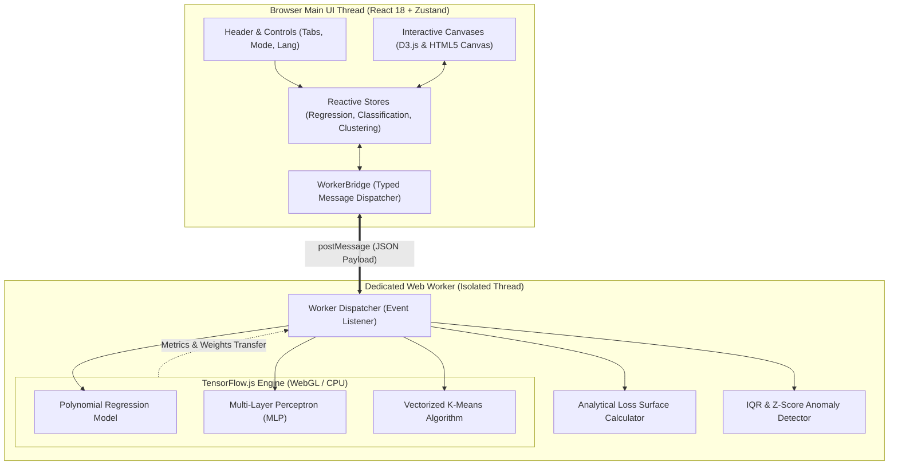

# ML Model Playground 🧪⚡
### Interactive In-Browser Machine Learning Laboratory | ห้องทดลอง Machine Learning แบบอินเทอร์แอคทีฟ 100% บนเบราว์เซอร์

[](https://zillerdx.github.io/ml-model-playground/)
[](https://vitejs.dev/)
[](https://react.dev/)
[](https://www.typescriptlang.org/)
[](https://www.tensorflow.org/js)
[](https://tailwindcss.com/)
[-emerald?logo=vitest&logoColor=white)](https://vitest.dev/)
[](LICENSE)

[**🌐 Live Demo (ลองใช้งานจริง)**](https://zillerdx.github.io/ml-model-playground/) • [**English Overview**](#-english-overview) • [**คู่มือภาษาไทย (Thai Overview)**](#-คู่มือภาษาไทย-thai-overview) • [**Architecture**](#-system-architecture) • [**Quickstart**](#-local-quickstart)

---

## 🌟 Visual Showcase

<div align="center">
  <a href="https://zillerdx.github.io/ml-model-playground/">
    
  </a>
  <p><em>☀️ Default High-Contrast Light Mode — Polynomial Regression ($y = 0.742x - 0.217$) & Real-Time Loss History Descent</em></p>
</div>

### 🔬 Interactive Studio Highlights

| 📈 Regression & Loss Surface $(w \text{ vs } b)$ | 🎯 Neural Network & Decision Boundary |
| :---: | :---: |
|  |  |
| **Loss Landscape**: 2D quadratic bowl $L(w,b)$ with live gradient descent ball trajectory rolling into the analytical OLS global minimum | **Decision Boundary**: Multi-Layer Perceptron (MLP) with Tanh activations wrapping concentric non-linear rings (100% accuracy) |

| 🧭 K-Means Clustering & Lloyd's Cycle | 📥 Custom CSV & Statistical Outlier Tools |
| :---: | :---: |
|  |  |
| **Lloyd's Cycle**: Step-by-step Voronoi partition assignment $\leftrightarrow$ centroid mean shifts with dynamic inertia (WCSS) drop | **Data Tools**: Real-time statistical IQR/Z-score outlier detection, 1-click filtering, and coordinate auto-normalization |

---

## 🇬🇧 English Overview

### 1. Target Audience (Who)
- **Students & ML Beginners**: Learners seeking intuitive grasp of fundamental optimization without being obstructed by dry formulas or Jupyter notebook syntax.
- **Data Practitioners & Quantitative Traders**: Engineers wanting rapid interactive spikes on custom 2D distributions and noise profiles before implementing production pipelines.
- **Educators & Lecturers**: University instructors seeking zero-setup, 60 FPS live demonstrations of loss landscapes, regularization, and decision boundaries.

### 2. The Problem
Conventional machine learning education tools (Jupyter Notebooks, Google Colab) suffer from high adoption friction:
- Requires Python runtime, virtual environments, and heavy dependency installations.
- Disconnected cell execution loops prevent real-time sensory feedback.
- Concepts such as **Gradient Descent trajectories**, **Learning Rate divergence**, **L1 vs L2 weight shrinkage**, and **Lloyd's Voronoi updates** remain abstract mathematical symbols.

### 3. The Solution
**ML Model Playground** is a 100% in-browser, local-first interactive laboratory powered by **TensorFlow.js** and dedicated Web Workers:
- **Zero Latency**: Real-time 60 FPS interactive visual feedback.
- **Total Privacy**: All training and data processing run completely in the browser client; zero data leaves the machine.
- **Pedagogical AHA Moments**: Witness gradient descent roll down an analytical 2D quadratic loss surface, observe polynomial curves fight or yield to outliers, and inspect neuron activations in real time.

### 4. Key Capabilities
- **📈 Module 1: Regression with Live 2D Loss Surface**
  - Linear and polynomial curve fitting up to degree 5.
  - Interactive **2D Weight Space Loss Contour ($w$ vs $b$)** plotting the analytical Ordinary Least Squares (OLS) global minimum $(w^*, b^*)$ alongside live gradient descent step trajectory breadcrumbs.
  - **L1 (Lasso) vs. L2 (Ridge)** penalty controls ($\lambda \in [0.001, 0.150]$) demonstrating sparsity vs. weight shrinkage.
  - Explicit divergence alerts when learning rate exceeds surface curvature stability.
- **🎯 Module 2: Neural Network Classification & Decision Boundary**
  - Configurable hidden layer topology ($[0]$ up to $[8, 8]$) with ReLU, Tanh, and Sigmoid activations.
  - Sub-pixel 2D decision boundary probability rasterization on HTML5 Canvas.
  - Interactive point placing for Class A ($0$) and Class B ($1$).
- **🧭 Module 3: Step-by-Step Lloyd's K-Means Clustering**
  - Step-by-step cycle breakdown: **Phase 1 (Voronoi Assignment)** $\leftrightarrow$ **Phase 2 (Mean Update)**.
  - K-Means++ probabilistic initialization vs. uniform random seeding.
  - Dynamic inertia curve (Within-Cluster Sum of Squares - WCSS) tracking convergence.
- **🔬 Statistical Outlier Detection & 1-Click Filtering**
  - Real-time sample anomaly evaluation using $1.5 \times \text{IQR}$ and $|z| > 2.6$ standard deviations.
  - Outlier injection with visual pulsating indicators and single-click automated cleaning.
- **📥 Custom CSV & Numeric Data Ingestion**
  - Flexible file parser supporting `.csv`, `.tsv`, and `.txt` coordinate pairs.
  - Optional auto-normalization scaling arbitrary coordinates into interactive canvas bounds.
- **💾 JSON Model Weight Export**
  - Instant export of learned weights, biases, optimizer configurations, and dataset coordinates for reproduction.
- **🌓 Ergonomic Design & Bilingual Interface**
  - Default crisp Light Mode and deep space Dark Mode (`#0B192C`).
  - Instant English (EN) and Thai (TH) localization with Google Fonts `Prompt` & `Sarabun`.

---

## 🇹🇭 คู่มือภาษาไทย (Thai Overview)

### 1. กลุ่มผู้ใช้งานเป้าหมาย (Target Audience)
- **นักเรียนและนักศึกษา**: ผู้เริ่มต้นศึกษา Machine Learning ที่ต้องการเห็นภาพว่า *"ทำไม Gradient Descent ถึงลู่เข้าแบบนี้"* ผ่านการทดลองสัมผัสจริง แทนการอ่านสูตรบนกระดาษ
- **สายเทรดและ Data Practitioners**: ผู้ที่ต้องการทดสอบสมมติฐานการฟิตเส้นกราฟ, วิเคราะห์ความอ่อนไหวต่อจุดรบกวน (Noise/Outliers), หรือสังเกตผลกระทบของ L1/L2 Regularization อย่างรวดเร็ว
- **อาจารย์และผู้สอน**: เครื่องมือประกอบการสอนสดในชั้นเรียนที่เปิดใช้งานได้ทันทีบนเบราว์เซอร์ ไม่ต้องติดตั้ง Environment

### 2. ปัญหาที่แอพพลิเคชันนี้เข้ามาแก้ไข
เครื่องมือ ML ทั่วไป (Jupyter Notebook, Google Colab) มีอุปสรรคสำหรับผู้เริ่มต้น:
- ต้องติดตั้ง Python, CUDA, TensorFlow/PyTorch ซึ่งใช้เวลานานและมักพบปัญหา Dependency
- การรันโค้ดทีละ Cell ไม่ให้ Visual Feedback แบบต่อเนื่องทันที (High Latency)
- ความเข้าใจเรื่อง **ผิวกระทะ Loss**, **Learning Rate ระเบิด (Divergence)**, หรือ **ขั้นตอนจัดกลุ่มของ K-Means** มักเข้าใจยากเมื่อดูเพียงตัวเลขหรือกราฟนิ่ง

### 3. นวัตกรรมและโซลูชัน
**ML Model Playground** ออกแบบให้เป็นห้องทดลอง ML แบบ Client-Side 100%:
- **รันบนเบราว์เซอร์ด้วย TensorFlow.js**: ไม่มีคำขอส่งข้อมูลออกไปยังเซิร์ฟเวอร์ภายนอก ข้อมูลปลอดภัย 100%
- **สถาปัตยกรรม Web Worker แยกเธรด**: โมเดลเทรนด้วยความเร็วสูงโดยที่หน้าจอ UI ไม่กระตุก (Non-blocking 60 FPS)
- **เห็นภาพคณิตศาสตร์แบบ Interactive**: ปรับค่า Learning Rate แล้วดูลูกบอลกลิ้งลงผิวกระทะ Loss ได้แบบเรียลไทม์

### 4. ฟีเจอร์เด่นระดับโปร
1. **การถดถอย (Regression) & ผิวกระทะ Loss $(w \text{ vs } b)$**:
   - ปรับดีกรีพหุนาม 1–5, เลือก Optimizer (Adam, SGD, Momentum)
   - แท็บ **ผิวกระทะ Loss**: แสดงภูมิประเทศกำลังสอง (Quadratic Surface), จุดต่ำสุด OLS ทางทฤษฎี $(w^*, b^*)$ และเส้นทางที่ Gradient เดินลงมาทีละก้าว
   - รองรับ **L1 (Lasso) และ L2 (Ridge) Regularization** พร้อมแถบเลื่อนค่าน้ำหนักบทลงโทษ ($\lambda$)
2. **การจำแนกประเภท (Classification) & ขอบเขตการตัดสินใจ**:
   - ปรับโครงสร้าง Hidden Layers ของ Neural Network และเลือกฟังก์ชันกระตุ้น (ReLU, Tanh, Sigmoid)
   - วาดจุดข้อมูล Class A / Class B เองบน Canvas ได้อย่างอิสระ
3. **การจัดกลุ่ม K-Means (Clustering)**:
   - โหมด **"ก้าวทีละก้าว (Step)"** แสดงการทำงานของ Lloyd's Cycle: *เฟส 1 (จับคู่จุดใกล้สุด)* สลับกับ *เฟส 2 (ขยับ Centroid ไปยังค่าเฉลี่ย)*
   - เลือกการกระจายจุดเริ่มต้นได้ทั้งแบบ K-Means++ และ Random พร้อมดูกราฟค่าความเฉื่อย Inertia (WCSS)
4. **ระบบตรวจจับและกรองจุดผิดปกติ (Outlier Detection & Filtering)**:
   - ตรวจจับจุดแปลกแยกด้วยสถิติ $1.5 \times \text{IQR}$ และ Z-score
   - ปุ่มจำลองจุดผิดปกติ (Inject) และปุ่มกรองจุดผิดปกติทิ้ง (Filter) ด้วยคลิกเดียว
5. **การนำเข้าไฟล์ CSV & ส่งออกโมเดล (Import & Export)**:
   - อัปโหลดไฟล์ `.csv` หรือวางตัวเลขพิกัด $(X, Y)$ พร้อมระบบปรับสเกลอัตโนมัติ
   - ส่งออกโครงสร้างและค่าน้ำหนักโมเดลเป็นไฟล์ JSON นำไปใช้งานต่อได้ทันที
6. **ดีไซน์ระดับสากล & รองรับ 2 ภาษา (EN/TH)**:
   - ค่าเริ่มต้นเป็น **Light Mode** สีขาวสบายตา และสลับเป็น **Dark Mode** ได้ทันที
   - สลับภาษาอังกฤษและไทยได้ 100% พร้อมชุดฟอนต์ `Prompt` และ `Sarabun` วรรณยุกต์คมชัด ไม่ตกขอบ

---

## 🏗️ System Architecture



---

## 🛠️ Technology Stack & Engineering Decisions

| Category | Technology | Rationale & Tradeoffs |
| :--- | :--- | :--- |
| **Framework** | **React 18 + Vite 6** | Ultra-fast HMR (<100ms) and minimal production bundle size (<350kB gzip). |
| **Language** | **TypeScript 5.5** | Strict type safety for complex numerical tensor shapes, worker messages, and translations. |
| **Machine Learning** | **TensorFlow.js 4.22** | Client-side tensor mathematics and automatic differentiation without backend server reliance. |
| **Threading** | **HTML5 Dedicated Web Worker** | Keeps the main UI rendering thread locked at 60 FPS while heavy epochs compute in the background. |
| **Visualization** | **D3.js v7 + HTML5 Canvas** | High-precision vector scales, smooth SVG interpolation, and 2D pixel grid rasterization. |
| **State Management** | **Zustand 4** | Zero-boilerplate atomic stores; eliminates React re-render cascades during rapid training loops. |
| **Typography & UI** | **Tailwind CSS + Google Fonts** | Utility-first tokens, dark/light theme classes, and Thai geometric sans-serif (`Prompt` & `Sarabun`). |
| **Automated Testing**| **Vitest 3.2** | Blazing fast ESM unit test runner verifying mathematical helpers and statistical detectors. |

---

## 🧪 Engineering Verification & Test Suite

All unit tests and production builds execute cleanly with zero errors:

```bash
# Automated Test Run
$ npx vitest run

 ✓ src/utils/mathHelpers.test.ts (4 tests)
 ✓ src/utils/datasetGenerators.test.ts (8 tests)

 Test Files  2 passed (2)
      Tests  12 passed (12)
   Duration  0.99s
  Exit Code  0
```

```bash
# Production Bundle Check
$ npm run build

vite v6.4.3 building for production...
✓ 2456 modules transformed.
dist/index.html                             1.15 kB │ gzip:  0.66 kB
dist/assets/trainingWorker-DfX2AZO8.js  1,602.22 kB
dist/assets/index-BDxoyqE3.css             25.55 kB │ gzip:  5.40 kB
dist/assets/index-CIfyo911.js             315.79 kB │ gzip: 96.72 kB
✓ built in 26.40s
Exit Code: 0
```

---

## 🚀 Local Quickstart

### Prerequisites
- Node.js 18+ or 20+
- npm 9+

### Installation & Run
```bash
# 1. Clone the repository
git clone https://github.com/ZillerDX/ml-model-playground.git
cd ml-model-playground

# 2. Install dependencies
npm install

# 3. Start local development server
npm run dev

# 4. Open in browser:
# Local Preview: http://localhost:5173/
```

### Running Tests
```bash
npm test
```

---

## 📄 License
This project is open-source and available under the [MIT License](LICENSE).
