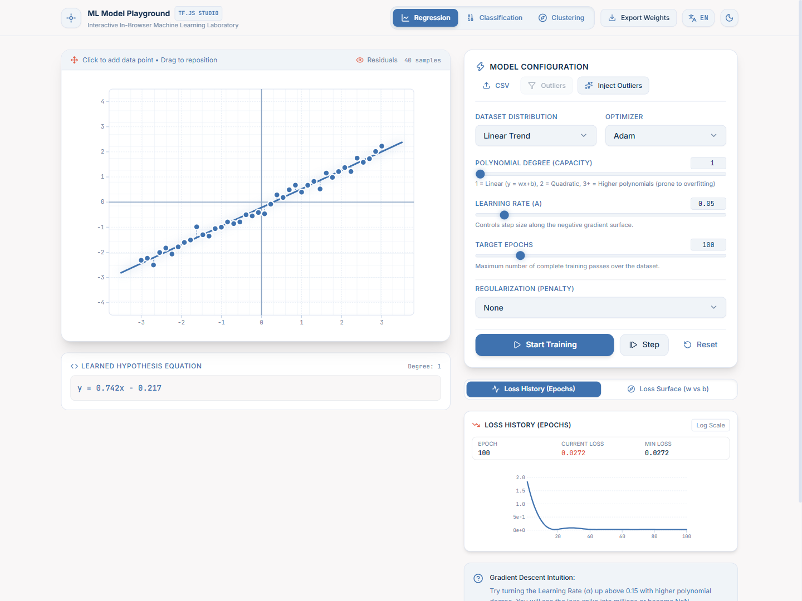
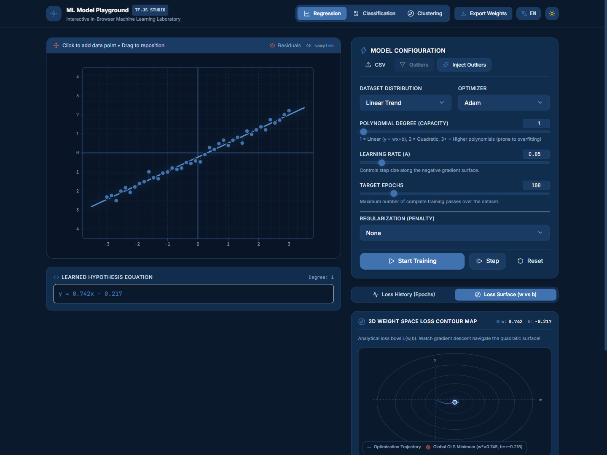
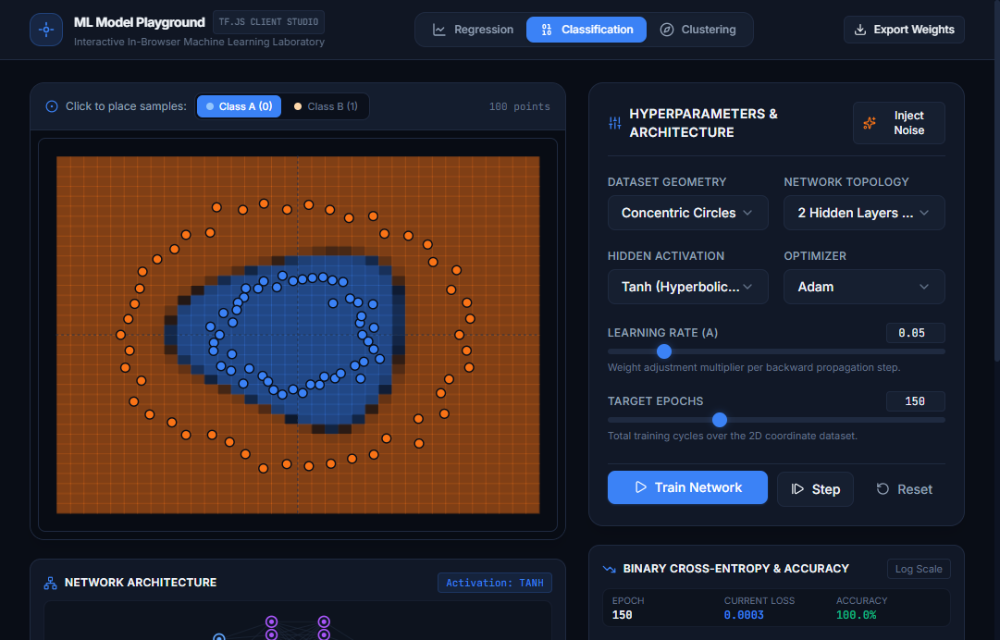
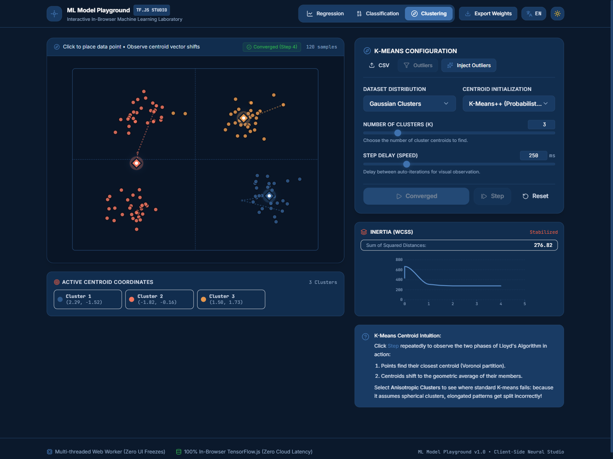
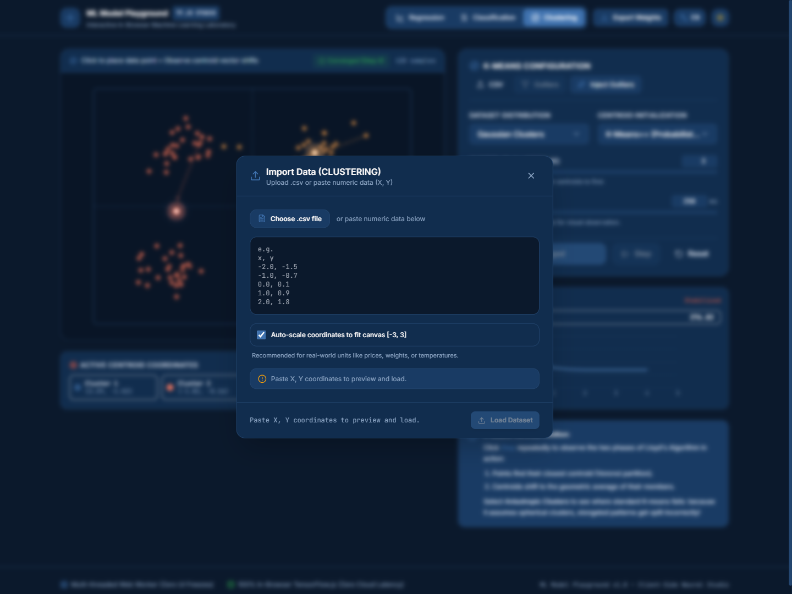
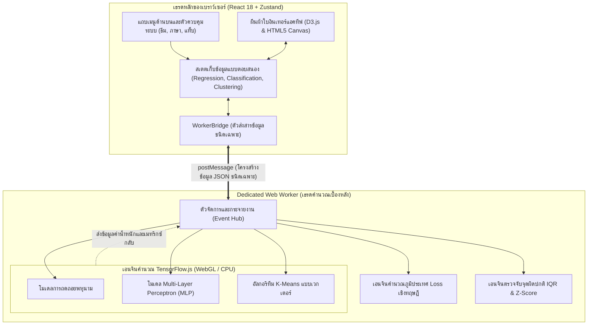

# ML Model Playground 🧪⚡

**ห้องทดลอง Machine Learning แบบอินเทอร์แอคทีฟ 100% บนเว็บเบราว์เซอร์ ไม่ต้องติดตั้งสภาพแวดล้อม**  
*ศึกษาพฤติกรรมการลู่เข้าของ Gradient Descent, ขอบเขตการตัดสินใจของ Neural Network และพลวัตการจัดกลุ่มของ K-Means แบบเรียลไทม์*

<p align="left">
  <a href="README.md"><b>English</b></a> • <a href="README.th.md"><b>ภาษาไทย</b></a> • <a href="https://zillerdx.github.io/ml-model-playground/"><b>ทดลองใช้งานจริง (Live Demo)</b></a>
</p>

[](https://zillerdx.github.io/ml-model-playground/)
[](https://vitejs.dev/)
[](https://react.dev/)
[](https://www.typescriptlang.org/)
[](https://www.tensorflow.org/js)
[](https://tailwindcss.com/)
[-emerald?logo=vitest&logoColor=white)](https://vitest.dev/)
[](LICENSE)

[**ทดลองใช้งานจริง**](https://zillerdx.github.io/ml-model-playground/) • [**ภาพรวมหน้าจอระบบ**](#-ภาพรวมหน้าจอระบบ-visual-showcase) • [**ปัญหาและทางออก**](#-ปัญหาและทางออกของระบบ-why-in-browser) • [**ฟีเจอร์เด่นทั้ง 3 โมดูล**](#-ฟีเจอร์เด่นทั้ง-3-โมดูล-key-capabilities) • [**สถาปัตยกรรมระบบ**](#-สถาปัตยกรรมระบบ-system-architecture) • [**เทคโนโลยีที่ใช้**](#-เทคโนโลยีและเหตุผลเชิงวิศวกรรม-tech-stack) • [**การตรวจสอบคุณภาพ**](#-การตรวจสอบคุณภาพเชิงวิศวกรรม-engineering-verification) • [**วิธีติดตั้งและเริ่มต้นใช้งาน**](#-วิธีติดตั้งและเริ่มต้นใช้งาน-quickstart) • [**English Version**](README.md)

---

## 🌟 ภาพรวมหน้าจอระบบ (Visual Showcase)

<div align="center">
  <a href="https://zillerdx.github.io/ml-model-playground/">
    
  </a>
  <p><em>☀️ โหมดเริ่มต้น High-Contrast Light Mode — การถดถอยพหุนาม ($y = 0.742x - 0.217$) พร้อมกราฟประวัติค่าความคลาดเคลื่อน (Loss) แบบ 60 FPS</em></p>
</div>

### 🔬 โมดูลห้องทดลองและเครื่องมือวิเคราะห์

| 📈 การถดถอย & ภูมิประเทศ Loss 2D ($w \text{ vs } b$) | 🎯 โครงข่ายประสาทเทียม & ขอบเขตการตัดสินใจ |
| :---: | :---: |
|  |  |
| **ภูมิประเทศ Loss**: ผิวกระทะกำลังสอง 2D $L(w,b)$ แสดงการกลิ้งของลูกบอล Gradient Descent สู่จุดต่ำสุดสัมบูรณ์ทางทฤษฎี OLS $(w^*, b^*)$ | **ขอบเขตการตัดสินใจ**: Multi-Layer Perceptron (MLP) ฟังก์ชันกระตุ้น Tanh โอบล้อมข้อมูลวงกลมไม่เชิงเส้นด้วยความแม่นยำ 100% |

| 🧭 การจัดกลุ่ม K-Means & วัฏจักรของ Lloyd | 📥 เครื่องมือไฟล์ CSV & วิเคราะห์จุดผิดปกติ |
| :---: | :---: |
|  |  |
| **วัฏจักรของ Lloyd**: แสดงการทำงานทีละก้าว: กำหนดกลุ่ม Voronoi $\leftrightarrow$ คำนวณค่าเฉลี่ย Centroid ใหม่ พร้อมกราฟความเฉื่อย WCSS แบบเรียลไทม์ | **เครื่องมือข้อมูล**: ตรวจจับจุดผิดปกติด้วยสถิติ $1.5 \times \text{IQR}$ และ $|z| > 2.6$, ปรับสเกลพิกัดอัตโนมัติ และกรองจุดรบกวนในคลิกเดียว |

---

## 💡 ปัญหาและทางออกของระบบ (Why In-Browser?)

### 1. ปัญหาของเครื่องมือแบบเดิม (The Problem)
เครื่องมือสำหรับการเรียนรู้ Machine Learning ดั้งเดิม (เช่น Jupyter Notebooks, Google Colab หรือ Terminal Scripts) มักสร้างอุปสรรคสำคัญต่อผู้เริ่มต้น:
- **ความยุ่งยากในการเตรียมสภาพแวดล้อม (Environment Setup Hell)**: ผู้เรียนต้องใช้เวลาหลายชั่วโมงในการแก้ปัญหาเวอร์ชันของ Python, Virtual Environment, ความขัดแย้งของ Dependencies และคอมไพเลอร์ CUDA ก่อนจะได้เริ่มทดลองจริง
- **วงจรการรันโค้ดที่ขาดความต่อเนื่อง (Disconnected Loops)**: การกดรันทีละ Cell ทำให้เกิดความล่าช้าทางความคิด ผู้เรียนไม่เห็นผลกระทบของไฮเปอร์พารามิเตอร์ต่อฟังก์ชันการปรับให้เหมาะสมได้ทันที
- **คณิตศาสตร์เชิงนามธรรมที่จับต้องยาก**: แนวคิดสำคัญอย่าง **Gradient Descent ก้าวเลยจุดต่ำสุด (Overshoot)**, **Learning Rate ระเบิด (Divergence)**, **ผลกระทบของ L1 vs. L2 ต่อค่าน้ำหนัก** และ **การแบ่งขอบเขตคลัสเตอร์ของ Voronoi** มักจำกัดอยู่เพียงสูตรบนหน้ากระดาษ

### 2. ทางออกและนวัตกรรม (The Solution)
**ML Model Playground** เปลี่ยนบทเรียนคณิตศาสตร์ที่เข้าใจยากให้กลายเป็นห้องทดลองแบบอินเทอร์แอคทีฟที่สัมผัสได้จริง โดยประมวลผลบนเบราว์เซอร์ของผู้ใช้ทั้งหมด:
- **การตอบสนองระดับ 60 FPS (Zero Latency)**: วาดกราฟ Loss, เส้นโค้งการฟิต และพื้นผิวความน่าจะเป็นด้วย **HTML5 Canvas** และ **D3.js** แบบเรียลไทม์
- **สถาปัตยกรรมแยกเธรดด้วย Web Worker**: การคำนวณเมทริกซ์และดิฟเฟอเรนเชียลแบบอัตโนมัติทำงานบน Dedicated Web Worker เบื้องหลังผ่าน **TensorFlow.js** ทำให้หน้าจอหลักไม่ค้าง ไม่กระตุก
- **ความเป็นส่วนตัวสมบูรณ์แบบ (Local-First)**: ประมวลผลบน Client-Side 100% ชุดข้อมูลและโมเดลไม่มีการส่งออกไปยังเซิร์ฟเวอร์ภายนอก

### 3. กลุ่มผู้ใช้งานเป้าหมาย (Who)
- **นักเรียนและนักศึกษา**: สร้างความเข้าใจเชิงเรขาคณิตของฟังก์ชันเป้าหมายและขอบเขตการตัดสินใจก่อนลงมือเขียนโค้ดจริงใน PyTorch หรือ TensorFlow
- **Data Scientists และนักเทรดเชิงปริมาณ (Quants)**: ทดลองสมมติฐานการฟิตข้อมูลสองมิติ ทดสอบความทนทานต่อสัญญาณรบกวน (Noise/Outliers) และวิเคราะห์ Regularization ได้ในไม่กี่วินาที
- **อาจารย์และผู้สอน**: เครื่องมือสาธิตประกอบการสอนสดในห้องเรียน ไม่ต้องกังวลเรื่องปัญหาความไม่เข้ากันของเครื่องคอมพิวเตอร์ผู้เรียน

---

## ⚡ ฟีเจอร์เด่นทั้ง 3 โมดูล (Key Capabilities)

### 📈 โมดูลที่ 1: การถดถอยพหุนาม & ภูมิประเทศ Loss 2 มิติ (Regression)
- **ฟิตเส้นโค้งพหุนาม (Polynomial Fitting)**: รองรับตั้งแต่ระดับเชิงเส้น (ดีกรี 1) จนถึงพหุนามดีกรี 5 ($y = \sum_{i=0}^d w_i x^i$)
- **ภูมิประเทศ Loss บนพื้นที่ค่าน้ำหนัก ($w \text{ vs } b$)**: วาดเส้นระดับชั้นความสูง (Contour) ของ Loss ควบคู่กับการแสดงจุดต่ำสุดสัมบูรณ์ทางทฤษฎี Ordinary Least Squares (OLS) $(w^*, b^*)$ และเส้นทางการเดินของ Gradient Descent ในแต่ละ Step
- **ระบบควบคุม Regularization (L1 vs. L2)**: เลื่อนปรับค่าบทลงโทษ ($\lambda \in [0.001, 0.150]$) เพื่อดูความเบาบางของพารามิเตอร์ (Sparsity จาก Lasso) เทียบกับการบีบขนาดค่าน้ำหนัก (Shrinkage จาก Ridge)
- **ระบบเตือนการลู่ออก (Divergence Warning)**: แจ้งเตือนทันทีเมื่อ Learning Rate สูงเกินขีดจำกัดความเสถียรของความโค้งผิวกระทะ
- **เลือก Optimizer ได้หลากหลาย**: รองรับทั้ง Adam, SGD และ Momentum

### 🎯 โมดูลที่ 2: โครงข่ายประสาทเทียม & ขอบเขตการตัดสินใจ (Classification)
- **ปรับโครงสร้างโครงข่ายได้อิสระ**: Multi-Layer Perceptron (MLP) ซ่อนได้สูงสุด 2 Hidden Layers (ตั้งแต่ $[0]$ จนถึง $[8, 8]$ โหนด)
- **ฟังก์ชันกระตุ้น (Activation Functions)**: สลับระหว่าง ReLU, Tanh และ Sigmoid ได้ทันที
- **เรนเดอร์ขอบเขตการตัดสินใจระดับซับพิกเซล**: คำนวณความน่าจะเป็นของแต่ละพิกัดบนตาราง Canvas พร้อมระบายสีแสดงระดับความเชื่อมั่น
- **ชุดข้อมูลมาตรฐานและวาดเองได้**: มีพรีเซ็ตข้อมูล Concentric Circles, Two Moons, XOR พร้อมโหมดคลิกเพิ่มจุด Class A / Class B บน Canvas ได้ตามใจชอบ
- **กราฟโครงข่ายประสาทสด**: แสดงค่าน้ำหนักและความหนาของเส้นเชื่อมโยง (Synapse Weights) ตามการเรียนรู้จริง

### 🧭 โมดูลที่ 3: การจัดกลุ่ม K-Means ตามวัฏจักรของ Lloyd (Clustering)
- **โหมดก้าวทีละก้าว (Step-by-Step Stepper)**: จำลอง 2 เฟสของ Lloyd's Algorithm อย่างชัดเจน:
  - **เฟส 1 (Voronoi Partition)**: กำหนดจุดข้อมูลไปยัง Centroid ที่ใกล้ที่สุด
  - **เฟส 2 (Mean Shift)**: เลื่อนพิกัด Centroid ไปยังตำแหน่งค่าเฉลี่ยของกลุ่ม
- **การสุ่มจุดเริ่มต้นอัจฉริยะ**: เปรียบเทียบระหว่าง **K-Means++** (สุ่มถ่วงน้ำหนักตามระยะทาง) และการสุ่มแบบเอกรูป (Uniform Random)
- **ติดตามการลู่เข้าด้วยกราฟความเฉื่อย**: พล็อตค่า WCSS (Within-Cluster Sum of Squares) ในแต่ละรอบเพื่อตรวจสอบจุดเสถียร (Elbow Point)

### 🔬 Data Studio: วิเคราะห์จุดผิดปกติ & จัดการไฟล์ CSV
- **เอนจินสถิติตรวจจับจุดผิดปกติ**: วิเคราะห์จุดแปลกแยกแบบเรียลไทม์ด้วยสถิติ $1.5 \times \text{IQR}$ และ Z-Score ($|z| > 2.6$)
- **ทดสอบความทนทานของโมเดล**: ปุ่มแทรกจุด Outliers เพื่อดูผลกระทบต่อโมเดล และปุ่มกรองจุด Outliers ทิ้งในคลิกเดียว
- **รองรับการนำเข้าไฟล์ CSV/TSV**: ตัวอ่านไฟล์ยืดหยุ่น รองรับคู่อันดับตัวเลขใดๆ พร้อมระบบปรับสเกลพิกัดให้พอดีกับ Canvas อัตโนมัติ
- **ส่งออกค่าน้ำหนักโมเดลเป็น JSON**: บันทึกค่าน้ำหนัก, ไบแอส, พารามิเตอร์ของ Optimizer และพิกัดข้อมูลเพื่อนำไปใช้อ้างอิงหรือรันต่อ

### 🌓 ดีไซน์และประสบการณ์ใช้งาน
- **ชุดสีมาตรฐานสากล**: โหมดสว่างสบายตา (Default Light Mode) และโหมดมืดโทนน้ำเงินเข้ม (`#0B192C`)
- **ระบบสลับ 2 ภาษาแบบไร้รอยต่อ**: รองรับภาษาอังกฤษ (EN) และภาษาไทย (TH) เต็มรูปแบบ ฟอนต์ `Prompt` และ `Sarabun` จัดช่องไฟวรรณยุกต์คมชัด ไม่เพี้ยน

---

## 🏗️ สถาปัตยกรรมระบบ (System Architecture)



---

## 🛠️ เทคโนโลยีและเหตุผลเชิงวิศวกรรม (Tech Stack)

| หมวดหมู่ | เทคโนโลยี | เหตุผลและข้อได้เปรียบทางวิศวกรรม |
| :--- | :--- | :--- |
| **Frontend Framework** | **React 18 + Vite 6** | รองรับ Hot Module Replacement ความเร็วสูง (< 100ms) และขนาด Production Bundle กะทัดรัด (< 350kB gzip) |
| **Language** | **TypeScript 5.5** | ตรวจสอบความถูกต้องของมิติเทนเซอร์ (Tensor Shapes), โครงสร้างข้อความ Worker และชุดคำแปลภาษา |
| **Machine Learning** | **TensorFlow.js 4.22** | คำนวณคณิตศาสตร์เทนเซอร์และหาอนุพันธ์อัตโนมัติบนเครื่องผู้ใช้โดยตรง ไม่พึ่งพาเซิร์ฟเวอร์ |
| **Concurrency** | **HTML5 Dedicated Web Worker** | แยกการวนรอบเทรนโมเดลออกจากเธรดแสดงผล ทำให้ UI ลื่นไหล 60 FPS ตลอดเวลา |
| **Visualization** | **D3.js v7 + HTML5 Canvas** | ผสานความแม่นยำของแกนเวกเตอร์ SVG เข้ากับความเร็วในการระบายเม็ดพิกเซล 2D ความถี่สูง |
| **State Management** | **Zustand 4** | สเตตขนาดเบาแบบอะตอมมิก ตัดปัญหาการ Re-render ซ้ำซ้อนของ React ในช่วงที่ข้อมูลอัปเดตถี่ |
| **Styling & Design** | **Tailwind CSS 3.4** | ระบบโทเค็นสีและฟอนต์มาตรฐาน รองรับวรรณยุกต์ภาษาไทยอย่างลงตัว (`Prompt` & `Sarabun`) |
| **Test Suite** | **Vitest 3.2** | รันชุดทดสอบคณิตศาสตร์และตัวตรวจจับทางสถิติได้อย่างรวดเร็ว |

---

## 🧪 การตรวจสอบคุณภาพเชิงวิศวกรรม (Engineering Verification)

ฟังก์ชันคำนวณทางคณิตศาสตร์ ตัวสร้างชุดข้อมูล และอัลกอริทึมตรวจจับจุดผิดปกติผ่านการทดสอบแบบอัตโนมัติทั้งหมด 100%:

```bash
# ผลการรัน Automated Unit Tests
$ npx vitest run

 ✓ src/utils/mathHelpers.test.ts (4 tests)
 ✓ src/utils/datasetGenerators.test.ts (8 tests)

 Test Files  2 passed (2)
      Tests  12 passed (12)
   Duration  0.99s
  Exit Code  0
```

```bash
# ผลการตรวจสอบ Production Build
$ npm run build

vite v6.4.3 building for production...
✓ 2456 modules transformed.
dist/index.html                             1.15 kB │ gzip:  0.66 kB
dist/assets/trainingWorker-DfX2AZO8.js  1,602.22 kB
dist/assets/index-BDxoyqE3.css             25.55 kB │ gzip:  5.40 kB
dist/assets/index-CIfyo911.js             315.79 kB │ gzip: 96.72 kB
✓ built in 26.40s
Exit Code: 0
```

---

## 🚀 วิธีติดตั้งและเริ่มต้นใช้งาน (Quickstart)

### สิ่งที่จำเป็นต้องมีในเครื่อง (Prerequisites)
- **Node.js**: เวอร์ชั่น 18.0.0 ขึ้นไป
- **npm**: เวอร์ชั่น 9.0.0 ขึ้นไป

### ขั้นตอนการรัน
```bash
# 1. โคลนคลังโค้ดลงเครื่อง
git clone https://github.com/ZillerDX/ml-model-playground.git
cd ml-model-playground

# 2. ติดตั้งแพ็กเกจที่จำเป็น
npm install

# 3. เริ่มต้นเซิร์ฟเวอร์สำหรับการพัฒนา (Development Server)
npm run dev

# 4. เปิดเบราว์เซอร์ไปที่ http://localhost:5173/
```

### คำสั่งอื่นๆ
```bash
# รันชุดทดสอบ Unit Tests
npm test

# บิลด์สำหรับ Production
npm run build

# พรีวิว Production Build ในเครื่อง
npm run preview
```

---

## 📄 ลิขสิทธิ์ (License)
โครงการนี้เป็นซอฟต์แวร์โอเพนซอร์สภายใต้สัญญาอนุญาต **[MIT License](LICENSE)**
